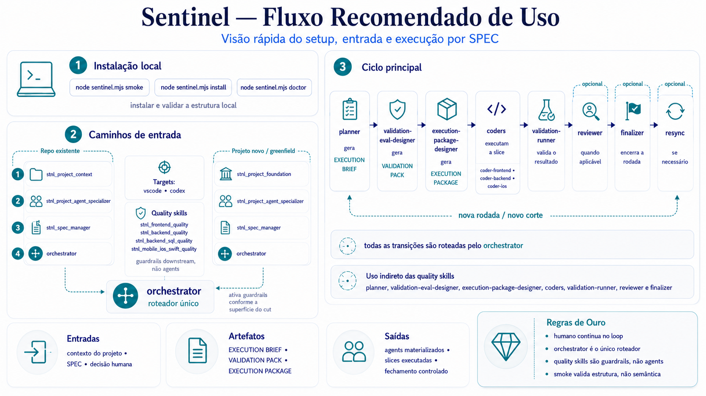

# Sentinel Protocol

**Status:** Alpha Preview - `v2026.5.1-alpha.1`

Sentinel Protocol é um kit pessoal e não oficial de protocolo para organizar trabalho de software assistido por IA em torno de contexto explícito de projeto, SPECs, agents especializados e execução controlada.

Esta release é a **Sentinel Protocol Alpha Preview**, a primeira alpha externa/controlada da arquitetura atual. Ela não é estável, não é um runtime autônomo de agents e não é afiliada, endossada ou oficial de nenhuma empresa.

Este repo é a fábrica do Sentinel Protocol: mantém skills, templates, agents base, installer e smoke. Os agents finais são materializados nos projetos alvo.

## Instalação local

Comando oficial único para instalar ou atualizar assets locais:

```sh
node sentinel.mjs install
node sentinel.mjs doctor
```

Use `node sentinel.mjs install --prune` somente quando quiser remover skills `stnl_*` instaladas em targets conhecidos, mas ausentes da versão atual do repo. `init` e `update` seguem disponíveis apenas como aliases de compatibilidade.

## Para quem é

Sentinel é para mantenedores que querem uma estrutura leve para:

- mapear contexto de projeto antes da execução;
- criar ou retomar SPECs rastreáveis;
- materializar agents específicos por projeto a partir de templates base;
- conduzir implementação por um fluxo controlado por `orchestrator`; no target Codex, o roteamento é parent-mediated por `ROUTE_PACKET`, depende de autorização explícita para subagent nativo e respeita profundidade máxima controlada.

Ele é útil quando o trabalho assistido por IA precisa de limites mais claros que prompts avulsos, mas ainda depende de julgamento humano.

## O que não resolve

Sentinel não substitui testes, code review, julgamento de produto ou responsabilidade humana. Ele não garante código correto sozinho.

Revisão humana é obrigatória. O smoke valida estrutura e wiring; ele não prova qualidade semântica completa em projetos reais.

## Fluxo recomendado



> Guia visual do fluxo recomendado.  
> A fonte de verdade continua sendo os templates, skills e documentação versionada do projeto.
>
>
Para repo existente:

1. `stnl_project_context`
2. `stnl_project_agent_specializer`
3. `stnl_spec_manager`
4. `orchestrator`; no target Codex, a sessão parent medeia `ROUTE_PACKET` com autorização explícita e max depth controlado

Para projeto novo ou greenfield:

1. `stnl_project_foundation`
2. `stnl_project_agent_specializer`
3. `stnl_spec_manager`
4. `orchestrator`; no target Codex, a sessão parent medeia `ROUTE_PACKET` com autorização explícita e max depth controlado

Targets suportados para materialização de agents:

- `vscode` -> `.github/agents/`
- `codex` -> `.codex/agents/` + `.codex/config.toml` + `AGENTS.md`

## Comece aqui

- [QUICKSTART.md](QUICKSTART.md)
- [PROMPTS.md](PROMPTS.md)
- [Agent Communication Flow](docs/workflow/AGENT-COMMUNICATION-FLOW.md)
- [CHANGELOG.md](CHANGELOG.md)
- [LICENSE](LICENSE)
