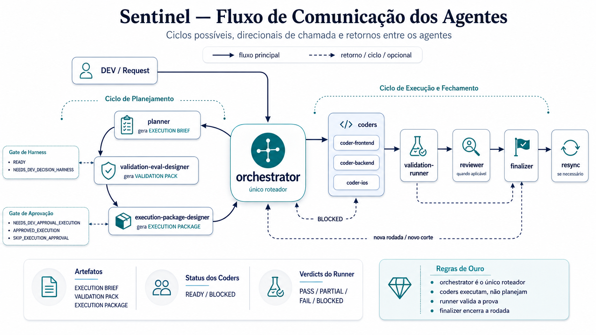

# Agent Communication Flow

This diagram shows the possible communication cycles between Sentinel agents, with `orchestrator` as the single routing owner.

## Quick reading

- `orchestrator` is the only router.
- `planner`, `validation-eval-designer`, and `execution-package-designer` form the planning/preparation cycle.
- `coders` execute authorized work packages and return `READY` or `BLOCKED`.
- `validation-runner` validates the proof defined in the `VALIDATION PACK`.
- `reviewer` enters when applicable.
- `finalizer` always closes terminal rounds.
- `resync` only enters when there is factual delta outside the feature.
